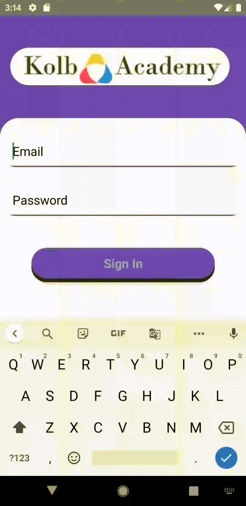
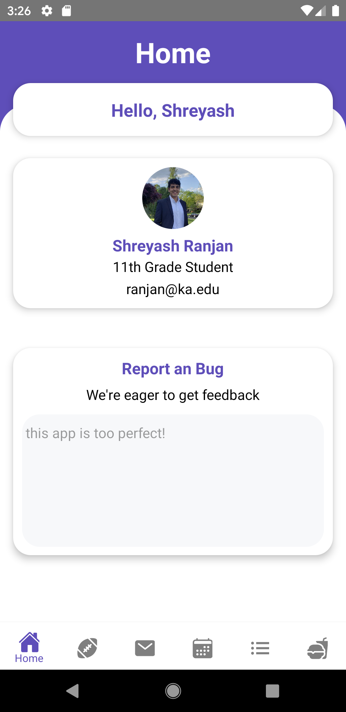
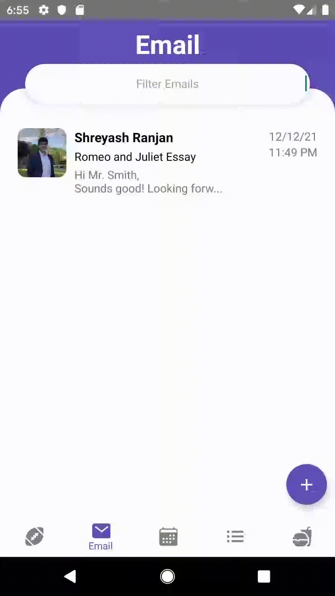

    

# Kolb Academy

## About

This mobile application is my submission for the Future Business Leaders of America state and national leadership conferences. Per the 2022 prompt, this application serves as a multifaceted tool for students at Kolb Academy (named after my APCS teacher) to 
* Input and view their schedules
* Get up-to-date information about extracurricular activities
* Check what's on the lunch menu
* Email their teachers and peers
* Track school events 

### Prerequisites

- Android 7.0 lollipop or higher
    - Unrestricted internet connection
- In order for the app to fully function on an android studio emulator, the following requirements:
    - The latest version of android studio is installed
    - API 22 is the android emulator's target API

## Installation Instructions

- Download the app-release.apk file to your computer
- Enable usb storage on the target android device (API 22+)
- Connect the target android device to the computer, wait for installation
- Copy the .apk from the computer to the target android device
- Turn of usb storage on the target android device and disable usb storage
- Disconnect the target android device from the computer
- Enable application installation from "unknown sources" in the target android device's settings
- Navigate to the .apk in the target android device's file manager
- Click on the .apk, choose to install it
- Back out of the file manager, the app should now be installed on the target android device

* In the event the .apk fails to run on an android device:
    - Clone the repository
    - Create a new android virtual device using API 22 and starting 
    - cd into `kolbacademy\Client\clientReactNative`
    - run `npm install`
    - run `react-native run-android`
    - The application should build and open on the android emulator

### User Guide

#### Users

|Name            |Email         |Password |Title                      |
| ---------------| -------------|---------|-------------------------- |
|Ryan    Kolb   |kolb@ka.edu   |496202   |AP Computer Science Teacher|
|Harold  Moyer  |moyer@ka.edu  |062369   |German Teacher             |
|Will    Hong   |hong@ka.edu   |051572   |10th Grade Student         |
|Dwight  Schrute|schrute@ka.edu|143427   |Karate Teacher             |
|Obi     Jide   |jide@ka.edu   |941618   |AP History Teacher         |
|Steve   Scott  |scott@ka.edu  |923778   |AP Calculus Teacher        |
|Joe     Smith  |smith@ka.edu  |710720   |English 11 Teacher         |
|Shreyash Ranjan |ranjan@ka.edu |373673   |11th Grade Student         |
|Karthik Patel  |patel@ka.edu  |800326   |11th Grade Student         |
|Ida     Wu     |wu@ka.edu     |250459   |Chemistry Teacher          |
|Tara    Jones  |jones@ka.edu  |382145   |12th Grade Student         |

Above is the list of users currently supported by the app. When testing the login, email, and scheduling features, please use one or more of these credentials.

### Login Screen

    

The application's authentication system is integrated with Google Firebase. As such when a user logs in with his or her credentials, they are sent to Firebase and verified against an encrypted keystore. If the credentials are valid, Firebase returns a unique client ID corresponding to the user. The application then uses this client ID to query the DynamoDB users table through the API to obtain identification information about the user (name, email, title, profile picture etc). This information is passed throughout the application, thereby allowing each user to have an customized experience unique to him or her.

#### Home Screen

    

On the home screen, users can view identification information like their title and email address. They also have the ability to report bugs to the developer for continuous improvement.

#### Schedule Screen

    

When users click on the schedule tab, they have the ability to view their list of classes filtered by each day of the school week. This view succinctly presents key information about each class, and lets users quickly view a their classes' name, time, location, teacher, and period.

Users can also click the floating action button in the bottom-right corner to open a modal containing a detailed, editable view of his or her courses. Here, they can efficiently slide through their class list, and edit specific attributes.

Changes to course details are updating in real-time and users can view their updated schedule immediately.

#### Menu Screen

    

On the menu tab, users can see what the Kolb Academy cafeteria will be serving in the upcoming week. Meal information is segmented into a scrollable view consisting of a main course, side dish, drink, and dessert. Like the schedule tab, users can easily filter by each day of the week to see when each meal will be served. An image of each food item as well as nutritional information is also provided for user convenience. 

#### Calendar Screen

    

On the calendar tab, users can view all of the exciting events happening at Kolb Academy. Users are presented with a scrollable calendar that allows for a seamless events unencumbered by button presses and dropdown menus. Dates with events have a blue circle underneath them. 

When clicked, the main calendar view retracts and users are can see the events listed in the selected week along with the time and location of each event.

When an event is clicked, a modal appears provided users with the ability to view and edit all information pertaining to the event. As is the case with other screens, all changes made in the modal are persisted in the database and changes are reflected for all users in real-time

#### Activities Screen

    

On the activities tab, users can view fun ways to stay involved at Kolb Academy at make the most of their time as students. Here, users scroll through the top pane to see various clubs and teams they have the option of joining.

When a club or team is clicked, the top card reflects the days and time it meets at as well as if it meets seasonally or year round.

The bottom card presents users with a scrollable roster of all members present in the club, along with their respective profile pictures and positions

#### Email Screen

    
    

        Image 1: viewing messages, filtering inbox, responding to email as a student
    

    
    

        Image 2: viewing email response from image 1 as a teacher
    

    
    

        Image 3: drafting and sending a new email
    

On the email tab, users can email their teachers and fellow students. When the tab is clicked, users arrive at their inbox and can see their email threads in sequential order. Users can filter their inbox by sender, subject, and message content.

When an email is clicked, a modal appears showing a detailed view of the selected email. Here, users can view the entire message thread and respond to the most recent email. When a response is sent, it appears in the recipient's inbox in real-time.

Users can also draft new emails and begin message threads by clicking the plus button in the bottom right corner.

 

## Built with

#### Frontend
I programmed the user interface of this application in a [React Native](https://reactnative.dev/), a free, open-source JavaScript framework developed by Facebook based on the popular web development framework React. When deciding how to best develop this mobile application, I decided to deviate from the more conventional Android Studio and Xcode development environments for 2 main reasons: **cross platform compatibility** and exposure to the **open-source community**.

**Cross Platorm**
Because of React Native's *learn once, write anywhere* philosophy, my application's source code was written (and can be further extended upon) only once, but is able to <ins>run on both ios and Android operating systems</ins>.

**Open Source**
Since React Native is itself and open-source framework, it can be built upon and further improved by members of the general software engineering community. As such, the tools and libraries available to me are far greater than those inherently provided by Android and ios.

### Backend
I developed the backend of my application using Amazon Web Services' [Serverless Application Model](https://aws.amazon.com/serverless/sam/). Given that much of the business world is shifting to the cloud, I was eager to get exposure to AWS and learn more about the different services it offers. My backend is currently comprised of API Gateway, Lambda, DynamoDB, and S3. I decided to build my backend in a serverless manner because of its **scalable nature**, and **cost-effective pricing** (which is great for a broke student like me).   

    
    

        Backend Application Architecture
    

### Future Development

## Authors

* **Shreyash Ranjan** 
[Github](https://github.com/codingshreyash)
[LinkedIn](https://www.linkedin.com/in/shreyash-ranjan/)

## Acknowledgments

I would like to sincerely thank a few people, without who this project would not have ben possible:
* Mr. Ryan Kolb, my AP Computer Science teacher
* Mrs. Linda Westerlund, my FBLA advisor
